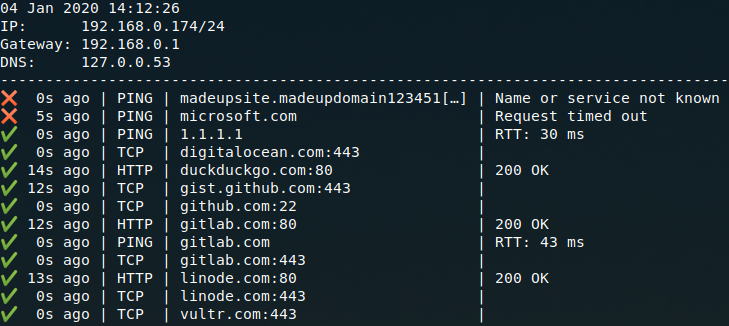

# Checker 🏁

[](https://dev.azure.com/jroeber/jroeber/_build/latest?definitionId=1&branchName=master)

A simple, standalone, console-based program to check that your network's services are up.

The [sample config](Examples/config.yml), when run with `checker -c config.yml`, produces the following:



It also runs a Prometheus endpoint on port 8080. You can scrape this endpoint with Prometheus and visualize it with Grafana.

## Build/Run

Build a standalone executable with .NET SDK 3:

```bash
dotnet tool install -g dotnet-warp # if you don't have dotnet-warp already
cd Checker
dotnet warp
```

On Linux, this creates a self-contained executable ~18 MB in size. It is portable and *does not* rely on any .NET libraries to be installed.

Run:

```bash
./checker -c config.yml
```

Or, if you want a scrapable Prometheus endpoint in Docker:

```bash
docker run \
  -d \
  -v $(pwd)/config.yml:/config.yml \
  -p 8080:8080 \
  --name checker \
  jroeber/checker
```

The Docker image *does not* give console output; it only runs a Prometheus endpoint. This is to avoid issues with logging systems.

For config file info and examples, head over to [examples](Examples/).

## Why

Other network monitors seem obnoxiously complex to me. I just want a simple way to see what well-known services are up and reachable on a potentially chaotic, rapidly-changing network.

Also, I didn't want to have to spend an hour learning a new tool...So I spent many more hours than that making a new one instead.

## Known Issues

- Console output on Windows command prompt is bad
- Not many checkers available yet (only ping, TCP, and HTTP right now)
